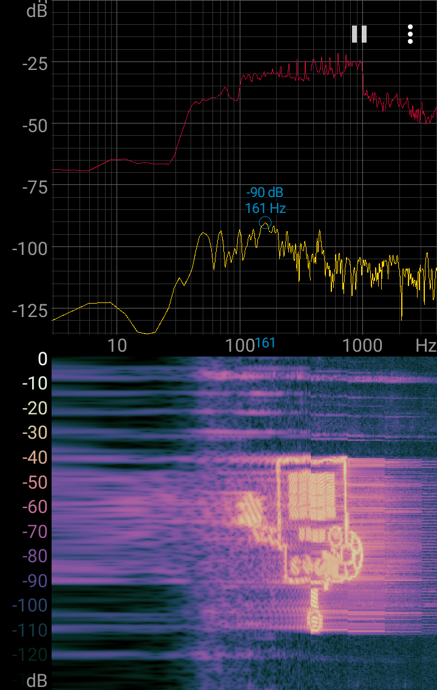

  

This little Python script converts an image to an audio file (.wav) so when played and analysed with a tool capable of plotting 
a heatmap of the spectrum over time (X-axis: log(frequency), Y-axis: time, color: power) such heatmap looks like the given image.
The script has been tested with an Android app called *Spectroid*.

## How to use
### Requirements
* Pillow (PIL wrapper)
* SciPy
* NumPy

### Execution
* Edit the script to change settings if wanted, the important things are `maxfreq` and `minfreq` that defines the interval of frequencies (in Hz) used and also `T` the duration (in seconds) of each pixel row.
* Run `python createwav.py [image.something]` and a `image.wav` will be created.
